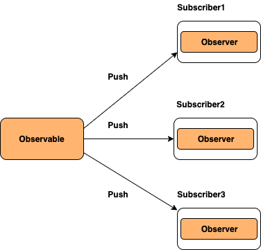

# Javascript-Interview-questions

# Table of Contents

<!-- TOC_START -->
| No. | Questions |
| --- | --------- |
| 1 | [What are the possible ways to create objects in JavaScript](#what-are-the-possible-ways-to-create-objects-in-javascript) |
| 2 | [What is a prototype chain](#what-is-a-prototype-chain) |
| 3 | [What is closures](#what-is-closures) |
| 4 | [What is a JavaScript Hoisting](#what-is-a-javaScript-hoisting) |
| 5 | [What is a Event loop](#what-is-a-event-loop) |
| 6 | [What are TypeScript Interfaces](#What-are-TypeScript-Interfaces) |
| 7 | [Characteristics of javascript strict-mode](#Characteristics-of-javascript-strict-mode) |
| 8 | [What is Lexical Scoping?](#What-is-Lexical-Scoping?) |
| 9 | [What is function declaration vs function expression?](#What-is-function-declaration-vs-function-expression?) |
| 10 | [What are the Arrow functions](#What-are-the-Arrow-functions) |
| 11 | [What is an anonymous function](#What-is-an-anonymous-function) |
| 12 | [Immediately invoked function execution](#Immediately-invoked-function-execution) |
| 13 | [JavaScript pass-by-value or pass-by-reference](#JavaScript-pass-by-value-or-pass-by-reference) |
| 14 | [What is Literals](#What-is-Literals) |
| 15 | [What is a first class function](#what-is-a-first-class-function) |
| 16 | [What is a first order function](#what-is-a-first-order-function) |
| 17 | [What is a higher order function](#what-is-a-higher-order-function) |
| 18 | [What is a unary function](#what-is-a-unary-function) |
| 19 | [What is the currying function](#what-is-the-currying-function) |
| 20 | [What is a pure function](#what-is-a-pure-function) |
| 21 | [What is the Temporal Dead Zone](#what-is-the-temporal-dead-zone) |
| 22 | [What is memoization](#what-is-memoization) |
| 23 | [What is an observable](#what-is-an-observable) |
| 24 | [What are the differences between promises and observables](#what-are-the-differences-between-promises-and-observables) |
| 25 | [What is a Constructor](#what-is-a-constructor) |
| 26 | [What is an Object](#what-is-an-object) |
| 27 | [What is an Object Prototype](#what-is-an-object-prototype) |
| 28 | [What is a Prototype Chain and Shadowing properties](#what-is-a-prototype-chain-and-Shadowing-properties) |
| 29 | [What is a Promise](#what-is-a-promise) |
| 30 | [What is an Array](#what-is-an-array) |

| NodeJs | [Node Js Topics](#nodejs-topics) |

| No. | Questions |
| --- | --------- |
| 1 | [Understanding the Node.js Event Loop](#understanding-the-nodejs-event-loop) |
| 2 | [Child Process Module in Node.js](#2-child-process-module-in-nodejs) |
| 3 | [Worker Threads in Node.js](#3-worker-threads-in-nodejs) |
| 4 | [Node.js Cluster](#4-nodejs-cluster) |
| 5 | [Worker Threads in Node.js](#worker-threads-in-nodejs) |
| 6 | [Scaling Node.js application](#6-scaling-nodejs-application) |
<!-- TOC_END -->


<!-- QUESTIONS_START -->
1. ### What are the possible ways to create objects in JavaScript

	In JavaScript, an object is a collection of key-value pairs.
	Keys are called properties (if the value is data) or methods (if the value is a function).

   There are many ways to create objects in javascript as mentioned below:

   1. **Object literal syntax:**

      The object literal syntax (or object initializer), is a comma-separated set of name-value pairs wrapped in curly braces.

      ```javascript
      var object = {
           name: "Sudheer",
           age: 34
      };
      ```

      Object literal property values can be of any data type, including array, function, and nested object.

      **Note:** This is one of the easiest ways to create an object.
		- Easiest and most readable way.
		- Useful for small, single-use objects.  

   2. **Object constructor:**

      The simplest way to create an empty object is using the `Object` constructor. Currently this approach is not recommended.

      ```javascript
      var object = new Object();
      ```

      The `Object()` is a built-in constructor function so "new" keyword is not required. The above code snippet can be re-written as:

      ```javascript
      var object = Object();
      ```
		- Rarely used directly (object literal {} is preferred).
		- Works like Object.create(Object.prototype).

   3. **Object's create method:**

      The `create` method of Object is used to create a new object by passing the specificied prototype object and properties as arguments, i.e., this pattern is helpful to create new objects based on existing objects.
      The second argument is optional and it is used to create properties on a newly created object.

      The following code creates a new empty object whose prototype is null.

      ```javascript
      var object = Object.create(null);
      ```
      The following example creates an object along with additional new properties.

      ```javascript
      let vehicle = {
        wheels: '4',
        fuelType: 'Gasoline',
        color: 'Green'
      }
      let carProps = {
        type: {
          value: 'Volkswagen'
        },
        model: {
          value: 'Golf'
        }
      }

      var car = Object.create(vehicle, carProps);
      console.log(car);
      ```

   4. **Function constructor:**

      In this approach, create any function and apply the new operator to create object instances.

      ```javascript
      function Person(name) {
        this.name = name;
        this.age = 21;
      }
      var object = new Person("Sudheer");
      ```

   5. **Function constructor with prototype:**

      This is similar to function constructor but it uses prototype for their properties and methods,

      ```javascript
      function Person() {}
      Person.prototype.name = "Sudheer";
      var object = new Person();
      ```

      This is equivalent to creating an instance with Object.create method with a function prototype and then calling that function with an instance and parameters as arguments.

      ```javascript
      function func() {}

      new func(x, y, z);
      ```

      **(OR)**

      ```javascript
      // Create a new instance using function prototype.
      var newInstance = Object.create(func.prototype)

      // Call the function
      var result = func.call(newInstance, x, y, z),

      // If the result is a non-null object then use it otherwise just use the new instance.
      console.log(result && typeof result === 'object' ? result : newInstance);
      ```
   6. **Object's assign method:**

      The `Object.assign` method is used to copy all the properties from one or more source objects and stores them into a target object.

      The following code creates a new staff object by copying properties of his working company and the car he owns.

      ```javascript
      const orgObject = { company: 'XYZ Corp'};
      const carObject = { name: 'Toyota'};
      const staff = Object.assign({}, orgObject, carObject);
      ```

   7. **ES6 Class syntax:**

      ES6 introduces class feature to create objects.

      ```javascript
      class Person {
        constructor(name) {
          this.name = name;
        }
      }

      var object = new Person("Sudheer");
      ```

   8. **Singleton pattern:**

      A Singleton is an object which can only be instantiated one time. Repeated calls to its constructor return the same instance. This way one can ensure that they don't accidentally create multiple instances.

      ```javascript
      var object = new (function () {
        this.name = "Sudheer";
      })();
      ```
	
	

    **[⬆ Back to Top](#table-of-contents)**

2. ### What is a prototype chain

   **Prototype chaining** is used to build new types of objects based on existing ones. It is similar to inheritance in a class based language. i.e, When you create an object using a constructor function or a class, the created object inherits properties from a prototype object.

   The prototype on object instance is available through **Object.getPrototypeOf(object)** or **\_\_proto\_\_** property whereas prototype on constructor function is available through **Object.prototype**.

   

   **[⬆ Back to Top](#table-of-contents)**

3. ### What is closures

	A closure is a function that has been bundled together (enclosed) with references to its surroundings (the lexical environment). In other words, a closure allows an inner function to access the scope of an outside function. Closures are formed every time a function is created in JavaScript, during function creation time. An example of closures in Javascript is given below:

	```javascript
	function subtractor(subtractingInteger) {
		return function(a) {
			return a - subtractingInteger;
		};
	}

	var subtract2 = subtractor(2);
	var subtract5 = subtractor(5);
	console.log(subtract2(5));  // 3 is logged
	console.log(subtract5(5)); // 0 is logged
	```
	In this example, we have developed a function subtractor(subtractingInteger) that takes a single parameter subtractingInteger and returns a new function. Its return function accepts only one input, a, and returns the difference of a and subtractingInteger. The function 'subtractor' is essentially a function factory. It creates functions that have the ability to subtract a specified value from their arguments. The function factory creates two new functions in the example above: one that subtracts 2 from its argument and one that subtracts 5 from its arguments. Both subtract2 and subtract5 are closures. They have the same function body definition, but they hold lexical surroundings that are distinct. subtractingInteger is 2 in subtract2's lexical environment, but subtractingInteger is 5 in subtract5's lexical environment.

	#### Real-world use cases

	- Data privacy (private variables)
	- Function factories (customized functions)
	- Event handlers remembering state
	- Once-only execution patterns

	**[⬆ Back to Top](#table-of-contents)**

4. ### JavaScript Hoisting

	Prior to executing the code, the interpreter appears to relocate the declarations of functions, variables, and classes to the top of their scope using a process known as Hoisting in JavaScript. Functions can be securely utilised in code before they have been declared thanks to hoisting. Variable and class declarations are likewise hoisted, allowing them to be referenced prior to declaration. It should be noted that doing so can result in unforeseen mistakes and is not recommended. There are usually two types of Hoisting:

	Function Hoisting: Hoisting has the advantage of allowing you to use a function before declaring it in your code as shown in the code snippet given below. Without function hoisting, we would have to first write down the function display and only then can we call it.

	```javascript
	display("Lion");
	function display(inputString) {
		console.log(inputString); // 'Lion' gets logged 
	}
	```

	Variable Hoisting: You can use a variable in code before it is defined and/or initialised because hoisting works with variables as well. JavaScript, however, only hoists declarations, not initializations! Even if the variable was initially initialised then defined, or declared and initialised on the same line, initialization does not occur until the associated line of code is run. The variable has its default initialization till that point in the execution is reached (undefined for a variable declared using var, otherwise uninitialized). An example of variable hoisting is shown below:

	```javascript
	console.log(x) // 'undefined' is logged from hoisted var declaration (instead of 7)
	var x // Declaration of variable x
	x = 7; // Initialization of variable x to a value 7
	console.log(x); // 7 is logged post the line with initialization's execution
	```

	**[⬆ Back to Top](#table-of-contents)**

5. ### What is a Event loop

	The Node.js event loop is a crucial concept in understanding how Node.js manages asynchronous operations and handles concurrency. Node.js is designed to be non-blocking and asynchronous, which allows it to efficiently handle a large number of I/O-bound operations without getting blocked by any single operation.

	Here's how the Node.js event loop works:

	1. Event Loop: The event loop is a central component of Node.js that manages all the asynchronous operations. It constantly checks for new events in the event queue and processes them in a loop.

	2. Event Queue: The event queue holds various types of events, such as callbacks, timers, and I/O events, that are generated as a result of asynchronous operations. These events are added to the queue when they are triggered but are not executed immediately.

	3. Callbacks: Callbacks are functions that are provided as arguments to asynchronous functions. They are executed once the corresponding asynchronous operation is completed and the event loop reaches the event in the queue. This mechanism allows Node.js to perform tasks without waiting for the completion of one task before moving on to the next.

	4. Timers: Node.js provides two types of timers: setTimeout() and setInterval(). These timers schedule callbacks to be executed after a specified amount of time or at regular intervals.

	5. I/O Operations: When Node.js performs I/O operations (e.g., reading from or writing to files, making network requests), it does not block the execution of the rest of the program. Instead, it delegates the I/O operation to the operating system and registers a callback to be executed when the operation is complete.

	6. Microtask Queue: In addition to the event queue, Node.js also maintains a microtask queue. Microtasks are tasks that have higher priority than regular callbacks and are executed before the next iteration of the event loop. Promises and certain APIs (e.g., process.nextTick()) add tasks to the microtask queue.

	GIF [Screenshot](images/event-loop.gif)

	Here's a simplified step-by-step breakdown of how the event loop works:

	1. Check the event queue for pending events.
	2. If there are pending events, dequeue an event and execute its associated callback.
	3. Execute any microtasks that are in the microtask queue.
	4. Perform any ready I/O operations.
	5. Check if any scheduled timers have expired. If yes, execute their callbacks.
	6. Repeat the process from step 1.

	Please check [First link](https://dev.to/endeavourmonk/nodejs-event-loop-46oo#:~:text=The%20event%20loop%20is%20a%20single%2Dthreaded%20loop%2C%20which%20means,in%20a%20non%2Dblocking%20manner.)
	[Second Link](https://www.freecodecamp.org/news/nodejs-eventloop-tutorial/)

	**[⬆ Back to Top](#table-of-contents)**

6. ### What are TypeScript Interfaces

	An interface in TypeScript is like a contract for an object’s shape.
	It defines the structure (properties, types, and methods) an object must follow, but does not contain implementation details.

	An interface in TypeScript defines the structure or skeleton of an object. It enforces a specific syntax on classes, specifying the types of data an object must have. Essentially, an interface acts as a contract that describes the shape of an object.

	Interfaces are capable of describing the wide range of shapes that JavaScript objects can take. In addition to describing an object with properties, interfaces are also capable of describing function types. To describe a function type with an interface, we give the interface a call signature.

	An interface is defined using the interface keyword:
	
	```javascript
	interface InterfaceName {
		PropertyName: Type;
		methodName() => Type;
	}
	// Interface for Array
	interface ForList {
    	[index:number]: string
	}
	let newArray: ForList = ["Interface", "for", "Array"];
	console.log(newArray); 
	```

	### ✅ 1. Extending Interfaces

	You can build on top of other interfaces.
	```js
	interface Person {
		name: string;
	}

	interface Employee extends Person {
		employeeId: number;
	}

	const emp: Employee = {
		name: "Alice",
		employeeId: 101
	};
	```
	### ✅ Key points:

	- Interfaces only define structure (no actual code execution).
	- Great for type safety.
	- Can be used with objects, functions, and classes.
	- Can extend other interfaces for reusability.
	- Helps in type-checking objects

	**[⬆ Back to Top](#table-of-contents)**

7. ### Characteristics of javascript strict-mode

	1. Strict mode does not allow duplicate arguments and global variables.
	2. One cannot use JavaScript keywords as a parameter or function name in strict mode.
	3. All browsers support strict mode. 
	4. Strict mode can be defined at the start of the script with the help of the keyword ‘use strict’. 

	**[⬆ Back to Top](#table-of-contents)**

8. ### What is Lexical Scoping?

	Lexical Scoping in JavaScript can be performed when the internal state of the JavaScript function object consists of the function’s code as well as references concerning the current scope chain.
	The ability of the function to be able to access variables of the parent is called lexical scope. In other words, the inner child function is always lexically bound to its parent and can always access its variables.
	
	Lexical scope in this case is the scope where the target variables were created not called. You can call a variable in one place but declare it in another place, for example, the parent function.

	### 1. Scope Chain Visual

	When JavaScript looks for a variable:

	1. It first checks the local scope (inside the current function).
	2. If not found, it moves one level up to the parent scope.
	3. It continues until it reaches the global scope.

	Read More  [Link](https://medium.com/@catherineisonline/what-is-lexical-scope-in-javascript-708b1d1487ea)

	**[⬆ Back to Top](#table-of-contents)**

9. ### What is function declaration vs function expression?

	Functions are the main “building blocks” of the program. They allow the code to be called many times without repetition. The main purposes of functions: to avoid code duplication.

	`Parameter` - A parameter is the variable listed inside the parentheses in the function declaration (it’s a declaration time term).

	`Argument` - An argument is the value that is passed to the function when it is called (it’s a call time term).

	`Function Declaration` - a function, declared as a separate statement, in the main code flow:

	```javascript
	function showMessage() {
  		alert( 'Hello everyone!' );
	}
	```
	A Function Declaration can be called earlier than it is defined.
	```javascript
	sayHi("John"); // Hello, John

	function sayHi(name) {
		alert( `Hello, ${name}` );
	}
	```
	In strict mode, when a Function Declaration is within a code block, it’s visible everywhere inside that block. But not outside of it.


	`Function expressions` - As the function creation happens in the context of the assignment expression (to the right side of =), this is a Function Expression.
	```javascript
	let sayHi = function() {
		alert( "Hello" );
	};
	```
	A Function Expression is created when the execution reaches it and is usable only from that moment.
	```javascript
	sayHi("John"); // error!

	let sayHi = function(name) {  // (*) no magic any more
		alert( `Hello, ${name}` );
	}; 
	```

	**[⬆ Back to Top](#table-of-contents)**

10. ### What are the Arrow functions?
	An arrow function is a shorter/concise syntax for a function expression and does not have its own this, arguments, super, or new.target. These functions are best suited for non-method functions, and they cannot be used as constructors.

	```javascript
	let func = (arg1, arg2, ..., argN) => expression;

	let sum = (a, b) => a + b;

	/* This arrow function is a shorter form of:

	let sum = function(a, b) {
		return a + b;
	};
	*/

	alert( sum(1, 2) ); // 3
	```

	Arrow functions have no “this”. If this is accessed, it is taken from the outside.

	For instance, we can use it to iterate inside an object method:
	```javascript
	let group = {
		title: "Our Group",
		students: ["John", "Pete", "Alice"],

		showList() {
			this.students.forEach(
			student => alert(this.title + ': ' + student)
			);
		}
	};

	group.showList();
	```
	Here in forEach, the arrow function is used, so this.title in it is exactly the same as in the outer method showList. That is: group.title.

	If we used a “regular” function, there would be an error:

	Arrow functions can’t run with new
	Not having this naturally means another limitation: arrow functions can’t be used as constructors. They can’t be called with new.

	Arrow functions VS bind
	There’s a subtle difference between an arrow function => and a regular function called with .bind(this):

	1. .bind(this) creates a “bound version” of the function.
	2. The arrow => doesn’t create any binding. The function simply doesn’t have this. The lookup of this is made exactly the same way as a regular variable search: in the outer lexical environment.

	Arrows have no “arguments”
	Arrow functions also have no arguments variable.

	That’s great for decorators, when we need to forward a call with the current this and arguments.

	For instance, defer(f, ms) gets a function and returns a wrapper around it that delays the call by ms milliseconds:
	```javascript
	function defer(f, ms) {
		return function() {
			setTimeout(() => f.apply(this, arguments), ms);
		};
	}

	function sayHi(who) {
		alert('Hello, ' + who);
	}

	let sayHiDeferred = defer(sayHi, 2000);
	sayHiDeferred("John"); // Hello, John after 2 seconds
	```
	The same without an arrow function would look like:
	```javascript
	function defer(f, ms) {
		return function(...args) {
			let ctx = this;
			setTimeout(function() {
			return f.apply(ctx, args);
			}, ms);
		};
	}
	```
	Here we had to create additional variables args and ctx so that the function inside setTimeout could take them.

	**[⬆ Back to Top](#table-of-contents)**

11. ### What is an anonymous function?
	An anonymous function is a function without a name. The following shows how to define an anonymous function:
	```javascript
	const greet = function() {
		console.log("Hello!");
	};

	greet(); // Hello!
	```

	### ✅ Common Uses -
	- As a Callback Function
	- In Array Methods - Often used with map, filter,
	  forEach, reduce.
	- Immediately Invoked Function Expression (IIFE)
	- Event Handlers

	### ✅ Key Takeaways

	- Anonymous functions are unnamed.
	- They’re best for short, one-time use functions.
	- Often used as callbacks, IIFEs, and event handlers.
	- Can be made more concise using arrow functions.

	**[⬆ Back to Top](#table-of-contents)**

12. ### Immediately invoked function execution?
	If you want to create a function and execute it immediately after the declaration, you can declare an anonymous function like this:
	```javascript
	(function() {
		console.log('IIFE');
	})();
	```
	The primary reason to use an IIFE is to obtain data privacy because any variables declared within the IIFE cannot be accessed by the outside world. i.e, If you try to access variables from the IIFE then it throws an error as below,
	```javascript
	(function () {
		var message = "IIFE";
		console.log(message);
	})();
	console.log(message); //Error: message is not defined
	```
	Sometimes, you may want to pass arguments into an anonymous function, like this:
	```javascript
	let person = {
		firstName: 'John',
		lastName: 'Doe'
	};

	(function () {
		console.log(person.firstName + ' ' + person.lastName);
	})(person);
	```

	### ✅ Common Uses of IIFE
	- `Avoid Global Variable Pollution` - Variables stay inside the IIFE scope, avoiding global namespace pollution.
	- `Initialization Code` - Used for configuration setup before app runs.
	- `Private Variables & Methods` 


	**[⬆ Back to Top](#table-of-contents)**

13. ### JavaScript pass-by-value or pass-by-reference?	

	`Pass by Value`
	JavaScript is primarily a “pass by value” language. But what does this mean?

	`Pass by value` means when a variable is assigned to another variable, the value stored in the variable is copied into the new variable. They are independent of each other, each occupying its own memory space.
	```javascript
	let a = 10;
	let b = a;

	a = 20;

	console.log(a); // Outputs: 20
	console.log(b); // Outputs: 10
	```

	- When a function is called, the value of the variable is directly passed as an argument. Therefore, any modifications made inside the function do not impact the original value.
	- The parameters passed as arguments generate their own copies. Consequently, any alterations made inside the function apply to the copied value, not the original value.
	```javascript
	function Passbyvalue(a, b) {
		let tmp;
		tmp = b;
		b = a;
		a = tmp;
		console.log(`Inside Pass by value function -> a = ${a} b = ${b}`); // Output a =2 b =1
	}

	let a = 1;
	let b = 2;
	console.log(`Before calling Pass by value Function -> a = ${a} b = ${b}`);//Output a = 1 b = 2

	Passbyvalue(a, b);

	console.log(`After calling Pass by value Function -> a =${a} b = ${b}`);// Output a =1 b = 2
	```

	`Pass by Reference`
	While JavaScript is primarily a “pass by value” language, it uses a concept called “pass by reference” when dealing with objects (including arrays and functions).

	When an object is created in JavaScript, it is stored in a memory space, and the variable associated with it stores the memory address or reference where the object is stored.

	If you assign this object variable to another variable, it does not copy the object. Instead, it copies the reference to the object. Both variables now point to the same memory space, which means changes through one variable are reflected when accessing the object through the other variable.
	```javascript
	let obj1 = { value: 10 };
	let obj2 = obj1;

	obj1.value = 20;

	console.log(obj1.value); // Outputs: 20
	console.log(obj2.value); // Outputs: 20
	```
	In JavaScript, all function arguments are always passed by value. It means that JavaScript copies the values of the variables into the function arguments.
	In Pass by Reference, Function is called by directly passing the reference/address of the variable as an argument. So changing the value inside the function also change the original value. In JavaScript array and Object follows pass by reference property.
	In Pass by reference, parameters passed as an arguments does not create its own copy, it refers to the original value so changes made inside function affect the original value. 

	```javascript
	function PassbyReference(obj) {
		let tmp = obj.a;
		obj.a = obj.b;
		obj.b = tmp;

		console.log(`Inside Pass By Reference Function -> a = ${obj.a} b = ${obj.b}`); // Output  a = 20 b = 10
	}

	let obj = {
		a: 10,
		b: 20

	}
	console.log(`Before calling Pass By Reference Function -> a = ${obj.a} b = ${obj.b}`); // Output  a = 10 b = 20

	PassbyReference(obj)

	console.log(`After calling Pass By Reference Function -> a = ${obj.a} b = ${obj.b}`); // Output  a = 20 b = 10
	```

14. ### What is Literals?

	Literals represent values in JavaScript. These are fixed values—not variables—that you literally provide in your script.

	```js
	42           // Number literal
	"Hello"      // String literal
	true         // Boolean literal
	```


	#### Why Use Literals?

	- They’re direct, readable, and fast to write.
	- They make initializing values easier without using constructors like new Array() or new Object().

	Read More [Literals](https://developer.mozilla.org/en-US/docs/Web/JavaScript/Guide/Grammar_and_types#literals)

15. ### What is a first class function

    In Javascript, functions are first class objects. First-class functions means when functions in that language are treated like any other variable.

	This means you can:

	1. Assign a function to a variable
	2. Pass a function as an argument to another function
	3. Return a function from another function

    For example, in the below example, handler functions assigned to a listener

    ```javascript
    // Assign to variable
	const greet = function(name: string): string {
		return `Hello, ${name}`;
	};

	// Store in array
	const funcs = [greet];

	// Pass as argument
	function callFunction(fn: (n: string) => string) {
		console.log(fn("CK"));
	}

	// Return from another function
	function multiplier(x: number) {
		return function(y: number) {
			return x * y;
		};
	}

	callFunction(greet); // Hello, CK
	console.log(multiplier(5)(2)); // 10
    ```

	Why Are They Useful?

	- Callbacks (e.g., in setTimeout, forEach)
	- Higher-Order Functions (functions that take/return other functions)
	- Functional Programming
	- Event handling
	- Closures & currying

    **[⬆ Back to Top](#table-of-contents)**

16. ### What is a first order function

    A first-order function is a function that doesn’t accept another function as an argument and doesn’t return a function as its return value.

    ```javascript
    const firstOrder = () => console.log("I am a first order function!");

	function add(a: number, b: number): number {
		return a + b; // just works on values
	}
	console.log(add(2, 3)); // 5
    ```
	✅ add is first-order because it only works with primitive values and returns a primitive.

    **[⬆ Back to Top](#table-of-contents)**

17. ### What is a higher order function

    A higher-order function is a function that accepts another function as an argument or returns a function as a return value or both.
    The syntactic structure of higher order function will be as follows,

    ```javascript
    // Takes another function as an argument
	function applyTwice(fn: (n) => number, x) {
		return fn(fn(x));
	}

	function square(n) {
		return n * n;
	}

	console.log(applyTwice(square, 2)); // square(square(2)) = 16

	// Returns a function
	function powerOf(exp) {
		return function(base) {
			return base ** exp;
		};
	}

	const squareFn = powerOf(2);
	console.log(squareFn(5)); // 25
    ```
    You can also call the function which you are passing to higher order function as callback function.

    The higher order function is helpful to write the modular and reusable code. 

    **[⬆ Back to Top](#table-of-contents)**

18. ### What is a unary function

    A unary function (i.e. monadic) is a function that accepts exactly one argument. It stands for a single argument accepted by a function.

    Let us take an example of unary function,

    ```javascript
    const unaryFunction = (a) => console.log(a + 10); // Add 10 to the given argument and display the value
    ```

    **[⬆ Back to Top](#table-of-contents)**

19. ### What is the currying function

    Currying is the process of taking a function with multiple arguments and turning it into a sequence of functions each with only a single argument. Currying is named after a mathematician **Haskell Curry**. By applying currying, an n-ary function turns into a unary function.

    Let's take an example of n-ary function and how it turns into a currying function,

    ```javascript
    const multiArgFunction = (a, b, c) => a + b + c;
    console.log(multiArgFunction(1, 2, 3)); // 6

    const curryUnaryFunction = (a) => (b) => (c) => a + b + c;
    curryUnaryFunction(1); // returns a function: b => c =>  1 + b + c
    curryUnaryFunction(1)(2); // returns a function: c => 3 + c
    curryUnaryFunction(1)(2)(3); // returns the number 6
    ```

    Curried functions are great to improve **code reusability** and **functional composition**.

	Why Currying?
		helps avoid passing the same variable again and again
		helps to create Higher Order Functions
		fewer errors and side effects

	Currying vs Partial Application 🔥
	In currying, nested functions are equal to arguments, means each function must have a single argument.
	f(a, b, c) -> f(a)(b)(c)

	Partial Application transforms a function into another function with smaller arguments (less args).
	f(a, b, c) -> f(a)(b, c)

	
    **[⬆ Back to Top](#table-of-contents)**

20. ### What is a pure function

    A **Pure function** is a function where the return value is only determined by its arguments without any side effects. i.e, If you call a function with the same arguments 'n' number of times and 'n' number of places in the application then it will always return the same value.

    Let's take an example to see the difference between pure and impure functions,

    ```javascript
    //Impure
    let numberArray = [];
    const impureAddNumber = (number) => numberArray.push(number);
    //Pure
    const pureAddNumber = (number) => (argNumberArray) =>
      argNumberArray.concat([number]);

    //Display the results
    console.log(impureAddNumber(6)); // returns 1
    console.log(numberArray); // returns [6]
    console.log(pureAddNumber(7)(numberArray)); // returns [6, 7]
    console.log(numberArray); // returns [6]
    ```

    As per the above code snippets, the **Push** function is impure itself by altering the array and returning a push number index independent of the parameter value, whereas **Concat** on the other hand takes the array and concatenates it with the other array producing a whole new array without side effects. Also, the return value is a concatenation of the previous array.

    Remember that Pure functions are important as they simplify unit testing without any side effects and no need for dependency injection. They also avoid tight coupling and make it harder to break your application by not having any side effects. These principles are coming together with the **Immutability** concept of ES6: giving preference to **const** over **let** usage.

	### 🔑 Why Pure Functions are Important?

	- Easier to test (no hidden dependencies).
	- Easier to debug (no external effects).
	- Easier to parallelize (safe to run in multiple threads).
	- Basis of functional programming.

    **[⬆ Back to Top](#table-of-contents)**

21. ### What is the Temporal Dead Zone

    The Temporal Dead Zone(TDZ) is a specific period or area of a block where a variable is inaccessible until it has been intialized with a value. This behavior in JavaScript that occurs when declaring a variable with the let and const keywords, but not with var. In ECMAScript 6, accessing a `let` or `const` variable before its declaration (within its scope) causes a ReferenceError. 

    Let's see this behavior with an example,

    ```javascript
    function somemethod() {
      console.log(counter1); // undefined
      console.log(counter2); // ReferenceError
      var counter1 = 1;
      let counter2 = 2;
    }
    ```

    **[⬆ Back to Top](#table-of-contents)**

22. ### What is memoization

    Memoization is a functional programming technique which attempts to increase a function’s performance by caching its previously computed results. Each time a memoized function is called, its parameters are used to index the cache. If the data is present, then it can be returned, without executing the entire function. Otherwise the function is executed and then the result is added to the cache.
    Let's take an example of adding function with memoization,

    ```javascript
    const memoizAddition = () => {
      let cache = {};
      return (value) => {
        if (value in cache) {
          console.log("Fetching from cache");
          return cache[value]; // Here, cache.value cannot be used as property name starts with the number which is not a valid JavaScript  identifier. Hence, can only be accessed using the square bracket notation.
        } else {
          console.log("Calculating result");
          let result = value + 20;
          cache[value] = result;
          return result;
        }
      };
    };
    // returned function from memoizAddition
    const addition = memoizAddition();
    console.log(addition(20)); //output: 40 calculated
    console.log(addition(20)); //output: 40 cached
    ```

    **[⬆ Back to Top](#table-of-contents)**

23. ### What is an observable

	An Observable is basically a function that can return a stream of values either synchronously or asynchronously to an observer over time. The consumer can get the value by calling `subscribe()` method.
	Let's look at a simple example of an Observable

	```javascript
	import { Observable } from "rxjs";

	const observable = new Observable((observer) => {
		setTimeout(() => {
			observer.next("Message from a Observable!");
		}, 3000);
	});

	observable.subscribe((value) => console.log(value));
	```

	

	**Note:** Observables are not part of the JavaScript language yet but they are being proposed to be added to the language

	Some of the most common use cases of observables are web sockets with push notifications, user input changes, repeating intervals, etc

	**[⬆ Back to Top](#table-of-contents)**

24.	### What are the differences between promises and observables

	Some of the major difference in a tabular form

	| Promises                                                           | Observables                                                                              |
	| ------------------------------------------------------------------ | ---------------------------------------------------------------------------------------- |
	| Emits only a single value at a time                                | Emits multiple values over a period of time(stream of values ranging from 0 to multiple) |
	| Eager in nature; they are going to be called immediately           | Lazy in nature; they require subscription to be invoked                                  |
	| Promise is always asynchronous even though it resolved immediately | Observable can be either synchronous or asynchronous                                     |
	| Doesn't provide any operators                                      | Provides operators such as map, forEach, filter, reduce, retry, and retryWhen etc        |
	| Cannot be canceled                                                 | Canceled by using unsubscribe() method                                                   |

	**[⬆ Back to Top](#table-of-contents)**

25.	### What is a Constructor

	A constructor is a special function that creates and initializes an object instance of a class. In JavaScript, a constructor gets called when an object is created using the new keyword.
	The purpose of a constructor is to create a new object and set values for any existing object properties.

	When a constructor gets invoked in JavaScript, the following sequence of operations take place:

	A new empty object gets created.
	The this keyword begins to refer to the new object and it becomes the current instance object.
	The new object is then returned as the return value of the constructor.
	```Javascript
	//Constructor
	function User() {
		this.name = 'Bob';
	}

	var user = new User();

	//Object literal
	let user = {
		name: 'Bob'
	}
	```
	**[⬆ Back to Top](#table-of-contents)**

26.	### What is an Object

	An object is a collection of related data and/or functionality. These usually consist of several variables and functions (which are called properties and methods when they are inside objects).

	**[⬆ Back to Top](#table-of-contents)**

27. ### What is an Object Prototype

	Prototypes are the mechanism by which JavaScript objects inherit features from one another. JavaScript prototypes are used to access the properties and methods of objects. Inherited properties are originally defined in the prototype or parent object.Prototypes are a powerful and very flexible feature of JavaScript, making it possible to reuse code and combine objects.

	**[⬆ Back to Top](#table-of-contents)**

28. ### What is a Prototype Chain and Shadowing properties

	Every object in JavaScript has a built-in property, which is called its prototype. The prototype is itself an object, so the prototype will have its own prototype, making what's called a prototype chain. The chain ends when we reach a prototype that has null for its own prototype.

	
	Note: The property of an object that points to its prototype is not called prototype. Its name is not standard, but in practice all browsers use __proto__. The standard way to access an object's prototype is the Object.getPrototypeOf() method.
	```Javascript
	const myDate = new Date();
	let object = myDate;

	do {
	object = Object.getPrototypeOf(object);
	console.log(object);
	} while (object);

	// Date.prototype
	// Object { }
	// null
	```
	

	### Shadowing properties
	What happens if you define a property in an object, when a property with the same name is defined in the object's prototype? Let's see:

	```Javascript
	const myDate = new Date(1995, 11, 17);

	console.log(myDate.getTime()); // 819129600000

	myDate.getTime = function () {
		console.log("something else!");
	};

	myDate.getTime(); // 'something else!'
	```
	This should be predictable, given the description of the prototype chain. When we call getTime() the browser first looks in myDate for a property with that name, and only checks the prototype if myDate does not define it. So when we add getTime() to myDate, then the version in myDate is called.

	This is called "shadowing" the property.

	### Setting a prototype
	There are various ways of setting an object's prototype in JavaScript, and here we'll describe two: Object.create() and constructors.

	Using Object.create
	The Object.create() method creates a new object and allows you to specify an object that will be used as the new object's prototype.

	Here's an example:

	```JS
	Copy to Clipboard
	const personPrototype = {
		greet() {
			console.log("hello!");
		},
	};
	
	const carl = Object.create(personPrototype);
	carl.greet(); // hello!
	```
	Here we create an object personPrototype, which has a greet() method. We then use Object.create() to create a new object with personPrototype as its prototype. Now we can call greet() on the new object, and the prototype provides its implementation.

	Using a constructor
	In JavaScript, all functions have a property named prototype. When you call a function as a constructor, this property is set as the prototype of the newly constructed object (by convention, in the property named __proto__).

	So if we set the prototype of a constructor, we can ensure that all objects created with that constructor are given that prototype:

	```JS
	const personPrototype = {
		greet() {
			console.log(`hello, my name is ${this.name}!`);
		},
	};

	function Person(name) {
		this.name = name;
	}

	Object.assign(Person.prototype, personPrototype);
	// or
	// Person.prototype.greet = personPrototype.greet;
	```
	Here we create:

	an object personPrototype, which has a greet() method
	a Person() constructor function which initializes the name of the person to create.
	We then put the methods defined in personPrototype onto the Person function's prototype property using Object.assign.

	After this code, objects created using Person() will get Person.prototype as their prototype, which automatically contains the greet method.

	```JS
	const reuben = new Person("Reuben");
	reuben.greet(); // hello, my name is Reuben!
	```
	This also explains why we said earlier that the prototype of myDate is called Date.prototype: it's the prototype property of the Date constructor.	

  	**[⬆ Back to Top](#table-of-contents)**

29. ### What is a Promise

	A Promise is a proxy for a value not necessarily known when the promise is created. It allows you to associate handlers with an asynchronous action's eventual success value or failure reason. This lets asynchronous methods return values like synchronous methods: instead of immediately returning the final value, the asynchronous method returns a promise to supply the value at some point in the future.

	```Javascript
	const promise = new Promise((resolve, reject) => {
		// contain an operation
		// ...
		// return the state
		if (success) {
			resolve(value);
		} else {
			reject(error);
		}
	});
	```
	The function passed to new Promise is called the executor. When new Promise is created, the executor runs automatically. It contains the producing code which should eventually produce the result. In terms of the analogy above: the executor is the “singer”.

	[Check out Promise API](https://javascript.info/promise-api)

30. ### JavaScript Generators

	In JavaScript, a regular function is executed based on the run-to-completion model. It cannot pause midway and then continues from where it paused. A generator can pause midway and then continues from where it paused. For example:
	```Javascript
	function* generate() {
		console.log('invoked 1st time');
		yield 1;
		console.log('invoked 2nd time');
		yield 2;
	}
	```
30. ### Debouncing and Throttling.

	#### 1. What’s Debouncing?

	Debouncing ensures a function runs only after a certain time has passed without being called again.

	Useful for:

	- Search boxes (wait until the user stops typing before making an API call)
	- Resize events
	- Scroll events

	Debounce Implementation (First-Class + Closure)

	```js
	function debounce(func, delay) {
		let timeoutId; // closure variable

		return function(...args) {
			clearTimeout(timeoutId);
			timeoutId = setTimeout(() => {
				func.apply(this, args);
			}, delay);
		};
	}

	// Example usage:
	function searchQuery(query) {
		console.log(`Searching for: ${query}`);
	}

	const debouncedSearch = debounce(searchQuery, 500);

	// Simulating typing
	debouncedSearch("Hel");
	debouncedSearch("Hello");
	debouncedSearch("Hello W");
	debouncedSearch("Hello World"); 
	// Only "Hello World" will log after 500ms pause
	```

	### How this works:

	- debounce returns a new function (closure keeps timeoutId alive)
	- Every time the returned function runs, it resets the timer
	- Only runs after the user stops calling it for the given delay

	### 2. What’s Throttling?

	Throttling ensures a function runs at most once in a given interval, no matter how many times it’s triggered.
	
	Useful for:

	- Infinite scroll
	- Button click rate-limiting
	- Window resize handling

	Throttle Implementation
	```js
	function throttle(func, limit) {
		let inThrottle = false; // closure variable

		return function(...args) {
			if (!inThrottle) {
				func.apply(this, args);
				inThrottle = true;
				setTimeout(() => inThrottle = false, limit);
			}
		};
	}

	// Example usage:
	function logScroll() {
		console.log(`Scroll event at ${new Date().toLocaleTimeString()}`);
	}

	const throttledScroll = throttle(logScroll, 1000);

	window.addEventListener("scroll", throttledScroll);
	```

	How this works:

	- throttle returns a new function that remembers inThrottle
	- Runs immediately the first time, then blocks further calls until limit ms passes
	
	Why This Works with First-Class Functions + Closures

	- `First-Class` → We pass func as an argument and return a new function
	- `Closure` → Internal variables (timeoutId, inThrottle) stay alive across calls without polluting global scope
	- This combination is the backbone of many performance optimizations in JS

	
**[⬆ Back to Top](#table-of-contents)**

---
## Node Js Concepts
	
## 📘 Understanding the Node.js Event Loop
1. ### Understanding the Node.js Event Loop


## 🔧 What is Node.js?
Node.js is an open-source, cross-platform JavaScript runtime environment that executes JavaScript code outside a web browser. Built on Chrome’s V8 engine, Node.js enables developers to build scalable and high-performance applications, particularly for networked applications like web servers and APIs.

### Key Features:
- **Single-threaded, event-driven architecture**: Efficiently handles multiple client requests using the event loop.
- **Non-blocking I/O**: Performs asynchronous operations to prevent blocking the main thread.
- **Built on libuv**: A library that provides a consistent API for asynchronous I/O across operating systems.

---

## 🔄 What is the Event Loop?
The Event Loop is the core mechanism that enables Node.js to perform non-blocking I/O operations despite being single-threaded. It allows Node.js to handle multiple operations concurrently by offloading operations to the system kernel or a thread pool and queueing callbacks to be executed later.

---

## 🧩 Core Components of the Event Loop

### 1. 📚 Call Stack
- A data structure that records where in the program we are.
- Functions are pushed when invoked and popped when returned.
- Runs one function at a time.
- Tasks are pushed when invoked and popped when complete.
- Long-running tasks can block the stack.

### 2. 📥 Callback Queue
- Stores callback functions ready to be executed.
- Event loop pushes them to the call stack when it’s empty.

### 3. ⚡ Microtask Queue
- High-priority queue for `process.nextTick()` and Promises.
- Executed immediately after the current script and before any I/O tasks.

### 4. ⚙️ libuv Thread Pool
- Used for file system tasks, DNS lookups, and other asynchronous operations.
- Maintains a thread pool (default size: 4).

### 5. 🧵 Worker Threads
- Enables parallel execution of JavaScript code for CPU-intensive tasks.
- Operates independently from the main thread.

### 6. 🔍 Async Hooks
- API to monitor the lifecycle of asynchronous resources.
- Useful for debugging and performance monitoring.

### 7. ⏱️ Timers API
- `setTimeout()`: Executes after delay.
- `setInterval()`: Executes repeatedly after fixed delay.
- `setImmediate()`: Executes after the current poll phase.

---

## 🌀 Phases of the Event Loop
1. **Timers Phase** – Executes `setTimeout()` and `setInterval()` callbacks.
2. **Pending Callbacks Phase** – Executes I/O callbacks deferred to the next loop iteration.
3. **Idle, Prepare Phase** – Internal operations.
4. **Poll Phase** – Retrieves new I/O events and executes I/O-related callbacks.
5. **Check Phase** – Executes `setImmediate()` callbacks.
6. **Close Callbacks Phase** – Executes close events like `socket.on('close', ...)`.

### 🧵 Microtasks between phases:
- `process.nextTick()`
- Promise callbacks

---

## 🧠 How the Event Loop Works: Step-by-Step

1. **Initialization** – Starts the event loop and processes the script.
2. **Execution of Top-Level Code** – Synchronous code and setup for async operations.
3. **Processing Phases** – The loop enters phases and executes callbacks.
4. **Async Operations Handling** – Handled by kernel or thread pool; results queued.
5. **Loop Continuation** – Repeats while there are events to process.

---

## 🖼️ Visualizing the Event Loop

```sql
┌───────────────┐
│   Call Stack  │    ← Tasks go here first
└───────────────┘
       ↓
┌───────────────┐
│ Microtask Queue│  ← process.nextTick, Promises (handled first)
└───────────────┘
       ↓
┌───────────────┐
│ Callback Queue │  ← setTimeout, setInterval, setImmediate
└───────────────┘
       ↓
┌───────────────┐
│ Event Loop     │  ← Keeps checking: Is stack empty? Any microtasks? Any callbacks?
└───────────────┘
```

Source: GeeksforGeeks - Node.js Event Loop

---

## 🏁 Example: Order of Execution
```javascript
setTimeout(() => console.log('setTimeout'), 0);
setImmediate(() => console.log('setImmediate'));
process.nextTick(() => console.log('nextTick'));
Promise.resolve().then(() => console.log('Promise'));
```
**Expected Output:**
```javascript
nextTick
Promise
setTimeout
setImmediate
```
### Explanation:
- `process.nextTick()` and Promise callbacks are microtasks (executed first).
- `setTimeout()` runs in the timers phase.
- `setImmediate()` runs in the check phase.

---

## 🧩 Simple Breakdown: Node.js Event Loop Components

### 1. 📚 Call Stack — “The To-Do List”
- Runs one function at a time.
- Tasks are pushed when invoked and popped when complete.
- Long-running tasks can block the stack.

### 2. 📥 Callback Queue — “The Waiting Line”
- Stores delayed tasks (e.g. `setTimeout`).
- Waits until call stack is clear.

```javascript
setTimeout(() => console.log("Hello!"), 1000);
```

### 3. ⚡ Microtask Queue — “The Fast Lane”
- Handles `process.nextTick()` and Promises.
- Always processed before the callback queue.

### 4. 🔁 Event Loop — “The Coordinator”
- Checks if the call stack is clear.
- Runs microtasks first, then callbacks.
- Operates in continuous cycles (ticks).

### 5. ⚙️ Thread Pool — “Helpers in the Background”
- Handles heavy async tasks (file I/O, image resizing, etc.).
- Notifies when done, and callbacks go into callback queue.

### 6. 🧵 Worker Threads — “Backup Brains for Big Tasks”
- Run JS code in parallel threads.
- Useful for CPU-heavy operations.

### 7. 🔍 Async Hooks — “Behind-the-Scenes Monitor”
- Track async operation lifecycle.
- Good for debugging and error tracing.

### 8. ⏱️ Timers API — “Scheduled Tasks”
```javascript
setTimeout(() => console.log("Waited 1 sec"), 1000);
setImmediate(() => console.log("I run immediately after poll phase"));
```

---
## Event Loop Starvation

Event loop starvation occurs when synchronous, long-running operations block the event loop, preventing asynchronous tasks from executing in a timely manner. This can cause issues like slow response times, timeouts, and an unresponsive application.

### **Causes of Event Loop Starvation**:
- **Long-running synchronous operations**:
Synchronous code, like loops or file operations, can block the main thread, preventing the event loop from handling other tasks. 
- **Heavy computations**:
Complex algorithms or large data processing tasks can occupy the main thread for extended periods, starving other tasks. 
- **Blocking I/O operations**:
Synchronous network requests or file I/O operations can block the event loop. 
- **Inefficient DOM manipulation**:
Extensive DOM manipulations, especially in large applications, can lead to delays in rendering and responsiveness. 
- **Microtask overload**:
Excessive microtasks (like those from Promise.then()) can consume the event loop and delay callback execution.

### **Solutions to Avoid Event Loop Starvation**:
- **Asynchronous operations**:
Use asynchronous functions, callbacks, promises, and async/await to avoid blocking the main thread. 
- **Offloading tasks**:
Utilize Web Workers, threads, or separate processes for computationally intensive tasks. 
- **Microtask management**:
Be mindful of microtasks and chain them efficiently to avoid overwhelming the event loop. 
- **Efficient code**:
Optimize code for performance and minimize blocking operations. 
- **Monitoring and debugging**:
Use tools like node-inspector to identify and resolve bottlenecks in the event loop. 

---

## 📚 References & Further Reading
- [GeeksforGeeks: Node.js Event Loop](https://www.geeksforgeeks.org/node-js-event-loop/)
- [DEV Community: Node.js Event Loop](https://dev.to/endeavourmonk/nodejs-event-loop-46oo)
- [LogRocket: Node.js Event Loop Guide](https://blog.logrocket.com/complete-guide-node-js-event-loop/)

---
# 2.  Child Process Module in Node.js

### 🔧What is the child process module?
The child process is a core module that allows users to create and control subprocesses. These processes can execute system commands, run scripts in various languages, or even fork new instances of Node.js.
The primary purpose of the child process module is to allow the execution of multiple processes simultaneously without blocking the main event loop.
Using a child process is important for applications that need to handle CPU-intensive operations or execute external commands and scripts. With it, your applications can maintain high performance and responsiveness.

### Use cases for child processes

The child processes can be used for tasks including the following:

- **Parallel processing**: Child processing enables parallel processing by allowing your applications to distribute workloads across multiple CPU cores, considerably improving performance for CPU-intensive activities such as image processing and data analysis.

- **Running shell scripts**: Child processes can be used to execute shell scripts. You can use the exec technique to run shell commands and capture their output, and also the spawn method which offers greater control when directly running scripts.

- **Communication with other services**: The child processes play a vital role when it comes to communication. It communicates with external services such as databases, APIs, or microservices. They can be used to make calls to external APIs, do database queries, and communicate with other microservices.

### Creating a child process
To create a child process, Node.js provides us with four primary methods for creating a child process which are the exec(),execFile(),spawn(),fork()

### Differences between fork() and spawn()
Some of the differences between fork and spawn include:

- **Built-in communication channel**: The fork() automatically sets up an IPC (inter-process communication) channel between the parent and child processes. In contrast, spawn() does not establish this channel by default; developers must manually configure IPC if needed.

- **Isolation and independence**: Each child process generated by fork() is a separate Node.js process with its own V8 instance. The spawn() method, on the other hand, can launch any process, including Node.js apps, and does not provide the same level of isolation.

- **Use case specificity**: The fork() technique is specifically intended for situations in which you need to generate worker processes that are part of the same application but operate concurrently. In contrast, spawn() is more general-purpose and is used when you need to launch arbitrary commands or scripts outside of the Node.js ecosystem.

---

### 📚 References & Further Reading
- [Dev: Node.js child process](https://dev.to/oyedeletemitope/understanding-the-child-process-module-in-nodejs-11lp)
- [geeksforgeeks: Node.js child process](https://www.geeksforgeeks.org/node-js-child-process/)

---

# 3. Worker Threads in Node.js

Worker threads in Node.js allow you to run JavaScript code in parallel, utilizing multiple CPU cores to improve performance for CPU-intensive tasks. They operate independently of the main thread, preventing blocking and maintaining responsiveness.

### Why Do You Need Worker Threads ?
Node.js's single-threaded event loop shines when it comes to handling asynchronous I/O tasks. However, it struggles with CPU-intensive operations, such as parsing large files or performing complex calculations.

These tasks can block the event loop, causing slowdowns and delayed responses in your application.
Worker threads solve this issue by running CPU-bound tasks in separate threads. This way, the main thread remains free to handle I/O operations without getting bogged down by long-running computations.

### How Do Worker Threads Work?
Worker threads run in parallel to the main thread. You can create a new worker thread and assign it a task, such as processing data or performing a calculation. These threads communicate with the main thread via a messaging system.

### Key Features of Worker Threads
- **Multithreading**
Worker threads enable true multithreading in Node.js, allowing each thread to execute code independently. This is crucial for handling CPU-intensive tasks that would otherwise block the main event loop.

- **Memory Isolation**
Each worker thread has its own memory space, which reduces the risk of issues related to shared state. This makes it easier to manage parallel execution safely.

- **Concurrency**
Worker threads allow Node.js to handle multiple operations simultaneously, improving performance in CPU-bound tasks. This is particularly useful for applications that need to process large amounts of data or perform complex calculations.

### How to Use Worker Threads in Node.js
Using worker threads in Node.js is straightforward. Here's a basic example:
```JS
const { Worker, isMainThread, parentPort } = require('worker_threads');

if (isMainThread) {
  // Main thread: Create a worker thread
  const worker = new Worker(__filename);

  worker.on('message', (message) => {
    console.log(`Received from worker: ${message}`);
  });

  worker.postMessage('Hello, worker!');
} else {
  // Worker thread: Receive message from main thread
  parentPort.on('message', (message) => {
    console.log(`Received from main thread: ${message}`);
    parentPort.postMessage('Hello from worker!');
  });
}
```
**Explanation:**
- **isMainThread:** This check helps distinguish between the main thread and the worker thread. If it is true, the current script is running in the main thread; otherwise, it’s running as a worker.
- **Worker:** The Worker constructor is used to spawn a new worker thread. In this case, we’re spawning the current script (__filename) as the worker. The worker thread runs the same code but under a different execution context.
- **parentPort:** The worker communicates back to the main thread using parentPort, which acts as a channel for sending and receiving messages.
- **postMessage():** This method sends messages between the main thread and the worker thread. The main thread sends a message to the worker, and the worker sends a reply back.


- **Communication**
Worker threads communicate with the main thread through message-passing. Simple APIs like postMessage and onmessage facilitate this communication, enabling efficient data transfer between threads.

## 📚 References & Further Reading
- [Last9: Node.js worker thread](https://last9.io/blog/understanding-worker-threads-in-node-js/)
- [betterstack: Node.js worker thread](https://betterstack.com/community/guides/scaling-nodejs/nodejs-workers-explained/)
- [logrocket: Node.js worker thread](https://blog.logrocket.com/complete-guide-threads-node-js/#implementing-worker-pool)
- [medium: Node.js worker thread](https://medium.com/@manikmudholkar831995/worker-threads-multitasking-in-nodejs-6028cdf35e9d)

---

# 4. Node.js Cluster

## 📚 References & Further Reading
- [medium: Clustering in Node.js](https://medium.com/@vloban/clustering-in-node-js-4e0bf17b7f0b)
- [kinsta: Node.js clustering](https://kinsta.com/blog/node-js-clustering/)
- [logrocket: Node.js worker thread](https://blog.logrocket.com/complete-guide-threads-node-js/#implementing-worker-pool)
- [medium: Node.js worker thread](https://medium.com/@manikmudholkar831995/worker-threads-multitasking-in-nodejs-6028cdf35e9d)

---

# 6. Scaling Nodejs Application

## What is Scalability?
Scalability is the ability of an application to handle increasing traffic and growing demand while maintaining optimal performance. There are two primary types of scaling:

**Vertical Scaling:** Increasing the resources (e.g., CPU, memory) of a single server to handle more requests.
**Horizontal Scaling:** Adding more servers or instances to handle an increasing number of requests.

While vertical scaling is straightforward, it has limitations as no matter how powerful the server is, there is always a limit. Horizontal scaling is more flexible and preferred for large-scale applications, enabling you to distribute the load across multiple servers.

- **Resource**: [Node.js Scaling](https://dev.to/imsushant12/scaling-nodejs-applications-techniques-and-best-practices-3lc0)

---

# Node.js Interview Preparation

This README provides a comprehensive topic-wise guide for mastering Node.js concepts, especially useful for interview preparation. Each topic includes explanations, code examples, and best resources.

---

## 📚 1. Introduction to Node.js
- **What is Node.js**: Runtime built on Chrome's V8 engine.
- **Why use Node.js**: Non-blocking, event-driven architecture.
- **Use Cases**: APIs, real-time apps (chat, games), microservices.
- **Example**:
  ```js
  console.log('Hello from Node.js!');
  ```
- **Resource**: [Node.js Official Docs](https://nodejs.org/en/docs/)

---

## 🧵 2. Node.js Architecture
- **Event Loop & Call Stack**
- **Libuv**: Manages I/O operations.
- **Thread Pool vs Event Loop**
- **Example**:
  ```js
  setTimeout(() => console.log("Timer done"), 0);
  console.log("Code end");
  ```
- **Resource**: [Node.js Architecture Explained - RisingStack](https://blog.risingstack.com/node-js-event-loop-tutorial/)

---

## 📦 3. Modules and require()
- **CommonJS vs ES Modules**
- **Built-in Modules**: fs, path, http, os
- **Creating Custom Modules**
- **Example**:
  ```js
  // math.js
  module.exports.add = (a, b) => a + b;

  // app.js
  const math = require('./math');
  console.log(math.add(2, 3));
  ```
- **Resource**: [Node.js Modules Guide](https://nodejs.dev/en/learn)

---

## 🌐 4. Creating Web Server
- **http module**
- **Handling routes manually**
- **Basic Routing Example**:
  ```js
  const http = require('http');
  const server = http.createServer((req, res) => {
    if (req.url === '/') res.end('Home');
    else if (req.url === '/about') res.end('About');
    else res.end('404 Not Found');
  });
  server.listen(3000);
  ```
- **Resource**: [Net Ninja Node.js Playlist](https://www.youtube.com/playlist?list=PL4cUxeGkcC9jLYyp2Aoh6hcWuxFDX6PBJ)

---

## 🛠️ 5. Express.js Framework
- **Setup and Routing**
- **Middleware**: Custom & Built-in
- **Error Handling**
- **Example**:
  ```js
  const express = require('express');
  const app = express();

  app.get('/', (req, res) => res.send('Hello Express'));

  app.use((req, res) => res.status(404).send('Not Found'));

  app.listen(3000);
  ```
- **Resource**: [Express.js Docs](https://expressjs.com/)

---

## 💾 6. File System (fs module)
- **Read/Write/Append/Delete Files**
- **Sync vs Async**
- **Streams and Buffers**
- **Example**:
  ```js
  const fs = require('fs');
  fs.writeFile('test.txt', 'Hello FS!', err => {
    if (err) throw err;
    console.log('File written');
  });
  ```
- **Resource**: [FS Module Docs](https://nodejs.org/api/fs.html)

---

## 🧪 7. Testing in Node.js
- **Jest/Mocha/Chai**
- **Unit vs Integration Testing**
- **Example with Jest**:
  ```js
  test('adds 1 + 2 to equal 3', () => {
    expect(1 + 2).toBe(3);
  });
  ```
- **Resource**: [Jest Docs](https://jestjs.io/), [Mocha](https://mochajs.org/)

---

## 🌐 8. Asynchronous Programming
- **Callbacks, Promises, async/await**
- **Error Handling**
- **Example**:
  ```js
  const fetchData = async () => {
    try {
      const res = await fetch('https://api.example.com');
      const data = await res.json();
      console.log(data);
    } catch (err) {
      console.error(err);
    }
  };
  fetchData();
  ```
- **Resource**: [Async JS YouTube Tutorial by Web Dev Simplified](https://www.youtube.com/watch?v=PoRJizFvM7s)

---

## 🔒 9. Security and Environment Variables
- **dotenv package**
- **Helmet, CORS**
- **Sanitization Techniques**
- **Example**:
  ```js
  require('dotenv').config();
  console.log(process.env.API_KEY);
  ```
- **Resource**: [OWASP Node.js Security Cheat Sheet](https://cheatsheetseries.owasp.org/cheatsheets/Nodejs_Security_Cheat_Sheet.html)

---

## 🔌 10. Connecting to Databases
- **MongoDB (Mongoose)**
- **PostgreSQL (pg)**
- **Example (MongoDB)**:
  ```js
  const mongoose = require('mongoose');
  mongoose.connect('mongodb://localhost/test');
  ```
- **Resource**: [MongoDB Docs](https://www.mongodb.com/docs/), [Mongoose Docs](https://mongoosejs.com/)

---

## 📦 11. Package Management
- **npm vs yarn**
- **package.json, package-lock.json**
- **Installing, Removing, Updating Packages**
- **Resource**: [npm Docs](https://docs.npmjs.com/)

---

## 📈 12. Performance & Debugging
- **Node.js Inspector**
- **Memory Leaks, Heap Dumps**
- **Benchmarking Tools**
- **Resource**: [Debugging Node.js Guide](https://nodejs.org/en/docs/guides/debugging-getting-started/)

---

## What is middleware in Express.js? Provide an example.

Middleware in Node.js refers to a concept where functions can be used to process incoming requests before they reach their final destination and handle outgoing responses before they are sent back to the client. These functions sit in between the initial request and the final response, hence the term “middleware.”

Middleware functions in Express.js are functions that have access to the request object (req), the response object (res), and the next middleware function in the application's request-response cycle. Middleware can perform tasks such as executing code, modifying the request and response objects, ending the request-response cycle, and calling the next middleware function. For example:
```JS
    const express = require('express');
    const app = express();

    app.use((req, res, next) => {
      console.log('Request URL:', req.originalUrl);
      next();
    });

    app.get('/', (req, res) => {
      res.send('Hello World!');
    });

    app.listen(3000, () => {
      console.log('Server is running on port 3000');
    });
```
- **Middleware Chaining**: Middleware chaining in Express.js refers to the process of executing multiple middleware functions in sequence. Each middleware function performs specific tasks such as logging requests, handling authentication, or parsing request bodies. Middleware functions must call the next() function to pass control to the next middleware function in the chain. This approach allows for modular and maintainable code.

---
### File Upload In Node Js

File uploads in Express applications are managed using the multer middleware. It processes multipart/form-data, which is used for file uploads. For example:
```JS
	const multer = require('multer');
	const upload = multer({ dest: 'uploads/' });

	app.post('/upload', upload.single('file'), (req, res) => {
	res.send('File uploaded successfully!');
	});
```
---

## PM2 in a Node.js application.

Process management tools like PM2 are essential for maintaining Node.js applications in production. PM2 ensures continuous operation by automatically restarting applications if they crash, minimizing downtime. It provides features for starting, stopping, and monitoring processes, as well as real-time performance tracking.

PM2 enhances scalability through load balancing and cluster mode, running multiple instances of an application to distribute traffic and fully utilize system resources. It also simplifies log management and can generate startup scripts to ensure applications start on system boot, making it a comprehensive tool for managing Node.js applications in production.

---

# Streams and Buffers

In Node.js, streams and buffers are fundamental concepts for handling data efficiently, particularly when dealing with large amounts of data or continuous data flow.

## Buffers
A buffer is a temporary storage area in memory used to hold binary data. It's like an array of integers representing bytes of data. Buffers are crucial when interacting with files, network sockets, or any operation that involves raw binary data.

### How Buffers Work
Buffers handle binary data efficiently. Think of them like a bucket that temporarily holds water until you’re ready to use it. Buffers store chunks of data from streams, allowing you to process that data later.

Here’s an example of working with a buffer:
```js
// Creating a buffer
const buffer = Buffer.from('Hello, Node.js!', 'utf-8');

// Accessing data from a buffer
console.log(buffer.toString('hex')); // Output: 48656c6c6f2c204e6f64652e6a7321
console.log(buffer.toString('utf-8')); // Output: Hello, Node.js!
```
## Streams
A stream is an abstract interface for working with streaming data, meaning data that is processed piece by piece. Streams allow you to handle data sequentially without needing to load the entire dataset into memory. This is particularly useful for large files or continuous data sources. 

### There are four types of streams:

- **Readable**: Streams from which data can be read (e.g., reading from a file).
- **Writable**: Streams to which data can be written (e.g., writing to a file).
- **Duplex**: Streams that are both readable and writable (e.g., network sockets).
- **Transform**: Duplex streams that can modify or transform data as it is read or written (e.g., compression or encryption streams).

### How Streams Work
Let’s break down how streams work with a simple example.

Imagine you’re downloading a video. Instead of waiting for the entire video to download before you can start watching, streaming allows you to start watching right away. Data is received in small chunks, and you can begin viewing as soon as you have enough data.

In Node.js, this process is similar. When you read a file or receive data from an HTTP request, streams break the data into manageable chunks.
```js
const fs = require('fs');

// Creating a readable stream
const readableStream = fs.createReadStream('input.txt');

// Creating a writable stream
const writableStream = fs.createWriteStream('output.txt');

// Piping data from readable stream to writable stream
readableStream.pipe(writableStream);

// Handling data events
readableStream.on('data', (chunk) => {
    console.log(`Received chunk: ${chunk.length} bytes`);
});

readableStream.on('end', () => {
    console.log('Finished reading data');
});

readableStream.on('error', (err) => {
  console.error(`Error reading data: ${err}`);
});
```
### Key Events in Streams
Streams are event-driven, which means they emit certain events when specific actions take place. Some key events you’ll work with include:

- **data**: Emitted when a chunk of data is available.
- **end**: Emitted when no more data is available.
- **error**: Emitted when there’s an error with the stream.
- **finish**: Emitted when all the data has been written (used for writable streams).

### Buffering in Streams
Streams use buffers internally to manage the flow of data. When data is read from a source, it's temporarily stored in a buffer before being processed or sent to its destination. The highWaterMark property of a stream determines the size of this buffer. Buffering ensures that data is handled efficiently and prevents data loss or backpressure issues.

---

## 🎯 Bonus Topics
- **Event Emitters**
- **Worker Threads**
- **Child Processes**
- **Cluster Module**
- **WebSockets**

---

This README serves as a roadmap. Practice regularly and build small projects to reinforce concepts.

---

_Updated: April 2025_

